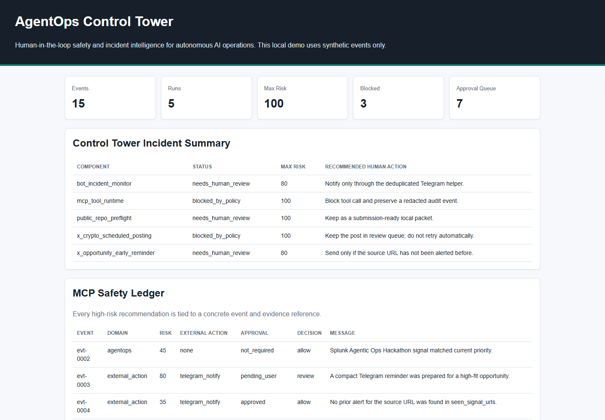

# Agentic Incident Command Center

Not another alert view: an AI incident commander that proves every claim in Splunk and asks before it acts.

Splunk-grounded incident decisions: cited root cause, blast radius, and human-approved remediation from one command flow.

## Judge in 5 Minutes

1. Open `reports/latest_control_tower.html`.
   You should see the checkout incident summary, ranked root cause, blast radius, and MCP Remediation Ledger.
2. Run the local proof path:

```powershell
python prototype\agentops_control_tower.py run-demo
python scripts\run_local_spl_query_pack.py
python scripts\build_judge_quickstart.py
```

You should see synthetic `agentops_events` regenerated, SPL-equivalent proof rebuilt, and a fresh judge quickstart at `reports/latest_judge_quickstart.html`.

3. Inspect the official MCP evidence:
   `submission/post_action_evidence/2026-06-09_optional_live_splunk_mcp_proof_readback.md`

The official Splunk MCP Server was verified against local Splunk Enterprise Docker using synthetic `agentops_events`; `splunk_run_query` returned incident event IDs, evidence refs, risk scores, and approval states. This does not claim production Splunk Cloud deployment.

Boundary phrase for all public materials: Local Splunk Enterprise Docker proof with synthetic data; production Splunk Cloud deployment is not claimed.

Every major claim links to a query or ledger entry a judge can inspect:

| Claim | Evidence path | What to look for |
| --- | --- | --- |
| Root cause is evidence-backed | `reports/latest_local_spl_query_results.html` | Timeline and root-cause evidence rows for `checkout-api`. |
| Blast radius is visible before action | `reports/latest_control_tower.html` | Affected services grouped before remediation. |
| Risky remediation remains human-approved | `reports/latest_control_tower.html` | MCP Remediation Ledger approval states. |
| Official MCP readback was verified locally | `submission/post_action_evidence/2026-06-09_optional_live_splunk_mcp_proof_readback.md` | `splunk_run_query` rows with event IDs and evidence refs. |

## Overview

Agentic Incident Command Center is a Splunk Agentic Ops Hackathon project candidate. It turns cross-domain incident signals into an evidence-backed AI command flow: timeline, blast radius, root-cause ranking, and human-approved remediation.

The project is built around a practical problem: during a live outage, the clues are scattered across deployment logs, application errors, APM traces, database pressure, identity/security events, edge networking, and AI/MCP tool calls. Splunk is the natural evidence layer. The AI should not invent a fix; it should ask Splunk, rank likely causes, cite evidence, and keep risky actions behind human approval.

The core innovation is the MCP Remediation Ledger: every AI-proposed rollback, WAF watch, ticket, stakeholder update, or credential-boundary block is tied to Splunk evidence and an explicit approval state.

The product impact is decision compression: scattered deploy, APM, database, security, edge, and MCP/tool-call signals become one reviewable flow from evidence to ranked cause to approval-ready action, without granting the agent unchecked remediation power.

This is an independent hackathon project and is not an official Splunk product. Splunk and related marks belong to their respective owners.



## What It Does

- Ingests synthetic incident events across deploy, application, APM, database, security, network, remediation, communications, and MCP runtime domains.
- Ranks likely root causes for a checkout outage using Splunk-ready evidence fields.
- Produces an MCP Remediation Ledger with evidence-backed proposed actions and approval states.
- Surfaces human action packets: approve rollback, approve a temporary WAF watch rule, review stakeholder update, preserve blocked credential-boundary evidence, or investigate further.
- Exports Splunk-ready CSV and SPL examples for indexing and MCP-based investigation.
- Includes a Splunk app candidate with index, sourcetype, dashboard, and saved-search configuration.
- Renders a local dashboard that demonstrates the complete flow without using private data.

## Why Splunk

Splunk is the natural operational data layer for this problem:

- Agentic systems create logs, events, traces, approvals, and tool-call records.
- Splunk can unify these signals across developer experience, security, and operations.
- Splunk MCP Server can expose this operational context to AI assistants while keeping the underlying data auditable.
- Human reviewers can ask questions in natural language, but every recommendation should still be grounded in concrete events.

## Demo Scenario

The local demo uses synthetic checkout-incident events:

1. A checkout API release completes shortly before a 5xx and latency spike.
2. Database pool pressure, identity anomalies, WAF probes, and edge packet loss appear as competing signals.
3. The AI incident commander asks for Splunk context and ranks `checkout-api release regression` as the primary cause.
4. Rollback, WAF watch, stakeholder update, and ticket creation are prepared as evidence-backed actions.
5. High-impact remediation stays human-approved, while a credential-boundary tool attempt is blocked and preserved as redacted audit evidence.

No real secrets, accounts, tokens, posts, payments, or external systems are used in the local demo.

## Full Local Build and Validation

```powershell
python prototype\agentops_control_tower.py run-demo
python scripts\run_local_spl_query_pack.py
python scripts\build_demo_tour.py
python scripts\build_video_readiness_report.py
python scripts\build_video_cue_sheet.py
python scripts\build_video_upload_metadata.py
python scripts\build_video_command_plan.py
python scripts\build_claim_evidence_matrix.py
python scripts\build_external_approval_packet.py
python scripts\build_publication_command_plan.py
python scripts\build_public_repo_metadata.py
python scripts\build_public_repo_publish_brief.py
python scripts\verify_public_repo_publication_gate.py
python scripts\build_public_launch_snapshot.py
python scripts\verify_public_artifact_urls.py
python scripts\build_devpost_submission_packet.py
python scripts\export_devpost_final_copy.py
python scripts\build_final_go_no_go_report.py
python scripts\build_devpost_submit_command_plan.py
python scripts\build_devpost_manual_fill_brief.py
python scripts\build_post_action_evidence_brief.py
python scripts\build_official_source_freshness.py
python scripts\build_release_integrity_manifest.py
python scripts\prepare_submission_urls.py
python scripts\validate_claim_boundaries.py
python scripts\validate_submission_urls.py
python scripts\validate_splunk_app.py
python scripts\package_splunk_app.py
python scripts\build_splunk_mcp_command_plan.py
python scripts\build_splunk_mcp_proof_brief.py
python scripts\build_splunk_mcp_prompt_pack.py
python scripts\build_splunk_mcp_proof_capture_manifest.py
python scripts\build_submission_gate_ledger.py
python scripts\build_submission_deadline_burndown.py
python scripts\build_submission_review_index.py
python scripts\build_judge_quickstart.py
python scripts\build_judge_scorecard.py
python scripts\build_launch_decision_brief.py
python scripts\build_content_rights_audit.py
python scripts\build_video_dry_run.py
python scripts\build_video_recording_preview.py
python scripts\verify_public_video_upload_gate.py
python scripts\build_eligibility_compliance_audit.py
python scripts\build_next_approval_packet.py
python scripts\build_approval_consistency_audit.py
python scripts\build_status_conflict_audit.py
python scripts\build_public_repo_dry_run.py
python scripts\verify_public_repo_publication_gate.py
python scripts\publish_public_repo_after_approval.py
python scripts\build_url_writeback_dry_run.py
python scripts\package_public_candidate_zip.py
python scripts\smoke_test_release_zip.py
```

Open:

```text
reports/latest_control_tower.html
reports/latest_claim_boundary_validation.html
reports/latest_devpost_final_copy.html
reports/latest_devpost_final_copy.md
reports/latest_submission_url_validation.html
reports/latest_release_zip_smoke_test.html
reports/latest_submission_review_index.html
reports/latest_demo_tour.html
reports/latest_video_readiness.html
submission/VIDEO_SCREEN_SAFETY_CHECKLIST.md
reports/latest_video_command_plan.html
reports/latest_video_cue_sheet.html
reports/latest_video_dry_run.html
reports/latest_video_recording_preview.html
reports/latest_video_upload_metadata.html
reports/latest_public_video_upload_preflight.html
reports/latest_claim_evidence_matrix.html
reports/latest_external_approval_packet.html
reports/latest_publication_command_plan.html
reports/latest_public_repo_metadata.html
reports/latest_public_repo_publish_brief.html
reports/latest_public_repo_dry_run.html
reports/latest_public_artifact_url_readback.html
reports/latest_url_writeback_dry_run.html
reports/latest_public_launch_snapshot.html
reports/latest_splunk_mcp_command_plan.html
reports/latest_splunk_mcp_proof_brief.html
reports/latest_splunk_mcp_prompt_pack.html
reports/latest_splunk_mcp_proof_capture_manifest.html
reports/latest_splunk_app_package_manifest.html
reports/latest_submission_gate_ledger.html
reports/latest_submission_deadline_burndown.html
reports/latest_judge_quickstart.html
reports/latest_judge_scorecard.html
reports/latest_launch_decision_brief.html
reports/latest_next_approval_packet.html
reports/latest_approval_consistency_audit.html
reports/latest_content_rights_audit.html
reports/latest_eligibility_compliance_audit.html
submission/HUMAN_CONFIRMATION_CHECKLIST.md
reports/latest_devpost_submit_command_plan.html
reports/latest_devpost_manual_fill_brief.html
submission/DEVPOST_FINAL_REVIEW_CHECKLIST.md
reports/latest_post_action_evidence_brief.html
reports/latest_official_source_freshness.html
reports/latest_release_integrity_manifest.html
reports/latest_status_conflict_audit.html
submission/POST_ACTION_EVIDENCE_LOG_TEMPLATE.md
reports/latest_devpost_submission_packet.html
reports/latest_final_go_no_go.html
reports/latest_local_spl_query_results.html
reports/latest_public_candidate_zip_manifest.html
reports/latest_submission_url_apply_plan.html
```

## Run Tests

```powershell
python -m unittest discover -s tests
```

## Validate Submission Packet

```powershell
python scripts\validate_submission_packet.py
```

This regenerates local outputs, runs the local SPL-equivalent query pack, validates claim boundaries, tests the package, checks screenshot/HTML essentials, and scans the public candidate for internal paths or secret-like strings.
It also checks the demo video script timing, screen safety checklist, video screen safety checklist, safe Splunk MCP claim wording, claim evidence matrix, explicit video command plan, video cue sheet, video dry run, video recording preview, video upload metadata, public video upload preflight, external approval packet, public repository publication command plan, public repo metadata, public repo publish brief, public repo publication preflight, public repo dry run, guarded public repo publication helper, URL writeback dry run, public launch snapshot, live Splunk/MCP proof command plan, live Splunk/MCP proof brief, live Splunk/MCP prompt pack, live Splunk/MCP proof capture manifest, submission gate ledger, submission deadline burndown, judge quickstart, judge scorecard, launch decision brief, next approval packet, approval consistency audit, status conflict audit, content rights and asset safety, eligibility and compliance, human confirmation checklist, Devpost final submission command plan, Devpost manual fill/readback brief, Devpost final review checklist, post-action evidence brief, post-action evidence log template, official source freshness, and release integrity manifest before any recording, upload, publication, URL writeback, or Devpost submission.
It also validates the local Splunk app candidate, including `default/indexes.conf`, `default/props.conf`, saved searches, dashboard XML, and the generated `.spl` package.

## Outputs

- `data/synthetic_agentops_events.jsonl`
- `data/agentops_event_schema.json`
- `data/splunk_agentops_events.csv`
- `reports/latest_analysis.json`
- `reports/latest_claim_boundary_validation.html`
- `reports/latest_claim_boundary_validation.json`
- `reports/latest_control_tower.html`
- `reports/latest_devpost_final_copy.html`
- `reports/latest_devpost_final_copy.json`
- `reports/latest_devpost_final_copy.md`
- `reports/latest_submission_url_validation.html`
- `reports/latest_submission_url_validation.json`
- `reports/latest_release_zip_smoke_test.html`
- `reports/latest_release_zip_smoke_test.json`
- `reports/latest_demo_tour.html`
- `reports/latest_video_readiness.html`
- `reports/latest_video_readiness.json`
- `submission/VIDEO_SCREEN_SAFETY_CHECKLIST.md`
- `reports/latest_video_command_plan.html`
- `reports/latest_video_command_plan.json`
- `reports/latest_video_command_plan.md`
- `reports/latest_video_cue_sheet.html`
- `reports/latest_video_cue_sheet.json`
- `reports/latest_video_cue_sheet.md`
- `reports/latest_video_dry_run.html`
- `reports/latest_video_dry_run.json`
- `reports/latest_video_dry_run.md`
- `reports/latest_video_recording_preview.html`
- `reports/latest_video_recording_preview.json`
- `reports/latest_video_recording_preview.md`
- `reports/latest_video_upload_metadata.html`
- `reports/latest_video_upload_metadata.json`
- `reports/latest_video_upload_metadata.md`
- `submission/VIDEO_UPLOAD_METADATA.md`
- `reports/latest_public_video_upload_preflight.html`
- `reports/latest_public_video_upload_preflight.json`
- `reports/latest_public_video_upload_preflight.md`
- `reports/latest_claim_evidence_matrix.html`
- `reports/latest_claim_evidence_matrix.json`
- `reports/latest_claim_evidence_matrix.md`
- `reports/latest_external_approval_packet.html`
- `reports/latest_external_approval_packet.json`
- `reports/latest_external_approval_packet.md`
- `reports/latest_publication_command_plan.html`
- `reports/latest_publication_command_plan.json`
- `reports/latest_publication_command_plan.md`
- `reports/latest_public_repo_metadata.html`
- `reports/latest_public_repo_metadata.json`
- `reports/latest_public_repo_metadata.md`
- `reports/latest_public_repo_publish_brief.html`
- `reports/latest_public_repo_publish_brief.json`
- `reports/latest_public_repo_publish_brief.md`
- `reports/latest_public_repo_publication_preflight.html`
- `reports/latest_public_repo_publication_preflight.json`
- `reports/latest_public_repo_publication_preflight.md`
- `reports/latest_public_repo_dry_run.html`
- `reports/latest_public_repo_dry_run.json`
- `reports/latest_public_repo_dry_run.md`
- `reports/latest_public_artifact_url_readback.html`
- `reports/latest_public_artifact_url_readback.json`
- `reports/latest_public_artifact_url_readback.md`
- `reports/latest_url_writeback_dry_run.html`
- `reports/latest_url_writeback_dry_run.json`
- `reports/latest_url_writeback_dry_run.md`
- `reports/latest_public_launch_snapshot.html`
- `reports/latest_public_launch_snapshot.json`
- `reports/latest_public_launch_snapshot.md`
- `reports/latest_splunk_mcp_command_plan.html`
- `reports/latest_splunk_mcp_command_plan.json`
- `reports/latest_splunk_mcp_command_plan.md`
- `reports/latest_splunk_mcp_proof_brief.html`
- `reports/latest_splunk_mcp_proof_brief.json`
- `reports/latest_splunk_mcp_proof_brief.md`
- `reports/latest_splunk_mcp_prompt_pack.html`
- `reports/latest_splunk_mcp_prompt_pack.json`
- `reports/latest_splunk_mcp_prompt_pack.md`
- `submission/SPLUNK_MCP_PROMPT_PACK.md`
- `reports/latest_splunk_mcp_proof_capture_manifest.html`
- `reports/latest_splunk_mcp_proof_capture_manifest.json`
- `reports/latest_splunk_mcp_proof_capture_manifest.md`
- `submission/SPLUNK_MCP_PROOF_CAPTURE_MANIFEST.md`
- `reports/latest_splunk_app_package_manifest.html`
- `reports/latest_splunk_app_package_manifest.json`
- `reports/latest_splunk_app_package_manifest.md`
- `reports/latest_submission_gate_ledger.html`
- `reports/latest_submission_gate_ledger.json`
- `reports/latest_submission_gate_ledger.md`
- `reports/latest_submission_deadline_burndown.html`
- `reports/latest_submission_deadline_burndown.json`
- `reports/latest_submission_deadline_burndown.md`
- `reports/latest_submission_review_index.html`
- `reports/latest_submission_review_index.json`
- `reports/latest_submission_review_index.md`
- `reports/latest_judge_quickstart.html`
- `reports/latest_judge_quickstart.json`
- `reports/latest_judge_quickstart.md`
- `reports/latest_judge_scorecard.html`
- `reports/latest_judge_scorecard.json`
- `reports/latest_judge_scorecard.md`
- `reports/latest_launch_decision_brief.html`
- `reports/latest_launch_decision_brief.json`
- `reports/latest_launch_decision_brief.md`
- `reports/latest_next_approval_packet.html`
- `reports/latest_next_approval_packet.json`
- `reports/latest_next_approval_packet.md`
- `submission/NEXT_APPROVAL_PACKET.md`
- `reports/latest_approval_consistency_audit.html`
- `reports/latest_approval_consistency_audit.json`
- `reports/latest_approval_consistency_audit.md`
- `submission/USER_APPROVAL_GATES.md`
- `reports/latest_content_rights_audit.html`
- `reports/latest_content_rights_audit.json`
- `reports/latest_content_rights_audit.md`
- `reports/latest_eligibility_compliance_audit.html`
- `reports/latest_eligibility_compliance_audit.json`
- `reports/latest_eligibility_compliance_audit.md`
- `submission/HUMAN_CONFIRMATION_CHECKLIST.md`
- `reports/latest_devpost_submit_command_plan.html`
- `reports/latest_devpost_submit_command_plan.json`
- `reports/latest_devpost_submit_command_plan.md`
- `reports/latest_devpost_manual_fill_brief.html`
- `reports/latest_devpost_manual_fill_brief.json`
- `reports/latest_devpost_manual_fill_brief.md`
- `submission/DEVPOST_FINAL_REVIEW_CHECKLIST.md`
- `reports/latest_post_action_evidence_brief.html`
- `reports/latest_post_action_evidence_brief.json`
- `reports/latest_post_action_evidence_brief.md`
- `reports/latest_official_source_freshness.html`
- `reports/latest_official_source_freshness.json`
- `reports/latest_official_source_freshness.md`
- `reports/latest_release_integrity_manifest.html`
- `reports/latest_release_integrity_manifest.json`
- `reports/latest_release_integrity_manifest.md`
- `reports/latest_status_conflict_audit.html`
- `reports/latest_status_conflict_audit.json`
- `reports/latest_status_conflict_audit.md`
- `submission/POST_ACTION_EVIDENCE_LOG_TEMPLATE.md`
- `submission/PUBLIC_REPO_METADATA.md`
- `reports/latest_submission_url_apply_plan.html`
- `reports/latest_submission_url_apply_plan.json`
- `reports/latest_submission_url_apply_plan.md`
- `reports/latest_devpost_submission_packet.html`
- `reports/latest_devpost_submission_packet.json`
- `reports/latest_final_go_no_go.html`
- `reports/latest_final_go_no_go.json`
- `reports/latest_local_spl_query_results.html`
- `reports/latest_local_spl_query_results.json`
- `reports/latest_public_candidate_zip_manifest.html`
- `reports/latest_public_candidate_zip_manifest.json`
- `release/agentops-control-tower-public-candidate.zip`
- `splunk_app/agentops_control_tower/default/data/ui/views/agentops_control_tower.xml`
- `splunk_app/agentops_control_tower/default/savedsearches.conf`
- `reports/latest_mcp_investigation.md`
- `reports/latest_submission_validation.html`
- `reports/latest_submission_validation.json`
- `dist/agentops-control-tower-splunk-app.spl`
- `assets/dashboard_preview.png`
- `submission/REQUIREMENTS_MATRIX.md`
- `submission/DEVPOST_FIELD_MAP.md`
- `submission/DEVPOST_FINAL_REVIEW_CHECKLIST.md`
- `submission/DEVPOST_SUBMISSION_DRAFT.md`
- `submission/DEMO_VIDEO_SCRIPT.md`
- `submission/VIDEO_RECORDING_RUNBOOK.md`
- `submission/FINAL_SUBMISSION_CHECKLIST.md`
- `submission/JUDGING_ALIGNMENT.md`
- `submission/OFFICIAL_REQUIREMENTS_AUDIT.md`
- `submission/SPL_QUERIES.md`
- `submission/SUBMISSION_DEADLINE_BURNDOWN.md`
- `submission/SUBMISSION_LAUNCH_RUNBOOK.md`
- `submission/SUBMISSION_REVIEW_QA.md`
- `architecture_diagram.md`

## Splunk Import

After importing `data/splunk_agentops_events.csv` into an `agentops_events` index, start with:

```spl
index=agentops_events risk_score>=70 | table _time component run_id event_type risk_score policy_decision evidence_ref message
```

See `submission/SPL_QUERIES.md` for the full demo query pack.
See `submission/SPLUNK_MCP_PROMPT_PACK.md` for the optional live MCP proof prompts, expected citations, success readbacks, and stop conditions.

The repository also includes a local Splunk app candidate:

```text
splunk_app/agentops_control_tower
```

It contains a Simple XML dashboard and saved searches for incident timeline, root-cause evidence, human-approved remediation ledger, MCP investigation context, and blast radius. Validate it locally with:

```powershell
python scripts\validate_splunk_app.py
```

Package it locally into a reviewable `.spl` artifact without installing, uploading, publishing, or connecting it:

```powershell
python scripts\package_splunk_app.py
```

This writes `dist/agentops-control-tower-splunk-app.spl` and `reports/latest_splunk_app_package_manifest.html`.

Before live Splunk access is approved, the same query intent can be checked locally with:

```powershell
python scripts\run_local_spl_query_pack.py
```

This writes `reports/latest_local_spl_query_results.html` and `.json` as proof that the incident timeline, root-cause evidence, human-approved remediation ledger, Splunk MCP investigation context, and blast-radius queries all return concrete rows over the generated CSV.

## Submission Track

Primary track:

- Observability

Secondary relevance:

- Platform & Developer Experience
- Security

Bonus target:

- Best Use of Splunk MCP Server

MCP Remediation Ledger provides auditability and guardrails for AI-proposed incident response actions.

## Safety Boundary

The current repository state is local-only. The following actions require explicit user approval:

- Splunk account, Splunk Cloud, Splunk Enterprise, or Developer License setup.
- Splunk MCP Server configuration involving credentials.
- Public GitHub repository publication.
- Public demo video upload.
- Approved public URL writeback into local submission artifacts.
- Devpost registration, draft save, or final submission.

The preflight gate `scripts\verify_public_repo_publication_gate.py` records the exact public GitHub approval phrase, source-folder review, isolated staging confirmation, scan confirmation, public visibility confirmation, and explicit public git identity before publication. The guarded helper `scripts\publish_public_repo_after_approval.py` runs as a local rehearsal by default. Its execute mode is gated by the exact public GitHub approval phrase plus explicit public git identity arguments, and it should only be used after the clean public candidate, isolated TEMP staging, scans, publication preflight, and publication readback plan are reviewed.

## License

Apache-2.0 candidate for public submission.
