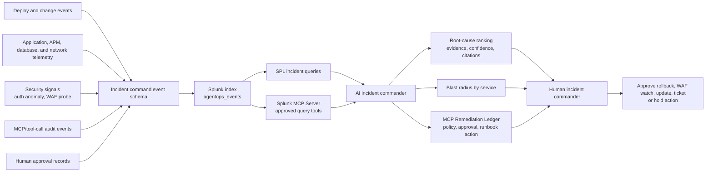
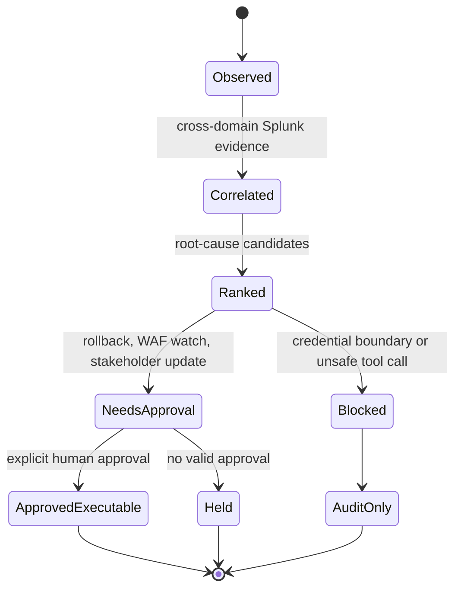

# Architecture Diagram

## Data Flow

1. Synthetic incident sources emit structured events for a checkout outage.
2. Events are indexed into Splunk as operational data.
3. SPL queries and Splunk MCP Server provide approved evidence access.
4. The AI incident commander ranks root causes and recommends next actions with citations.
5. Human reviewers approve, reject, or hold remediation. Risky actions never bypass approval.

## Safety Principle

The agent does not execute high-impact remediation on its own. It makes the human decision faster and more reliable by packaging evidence.

